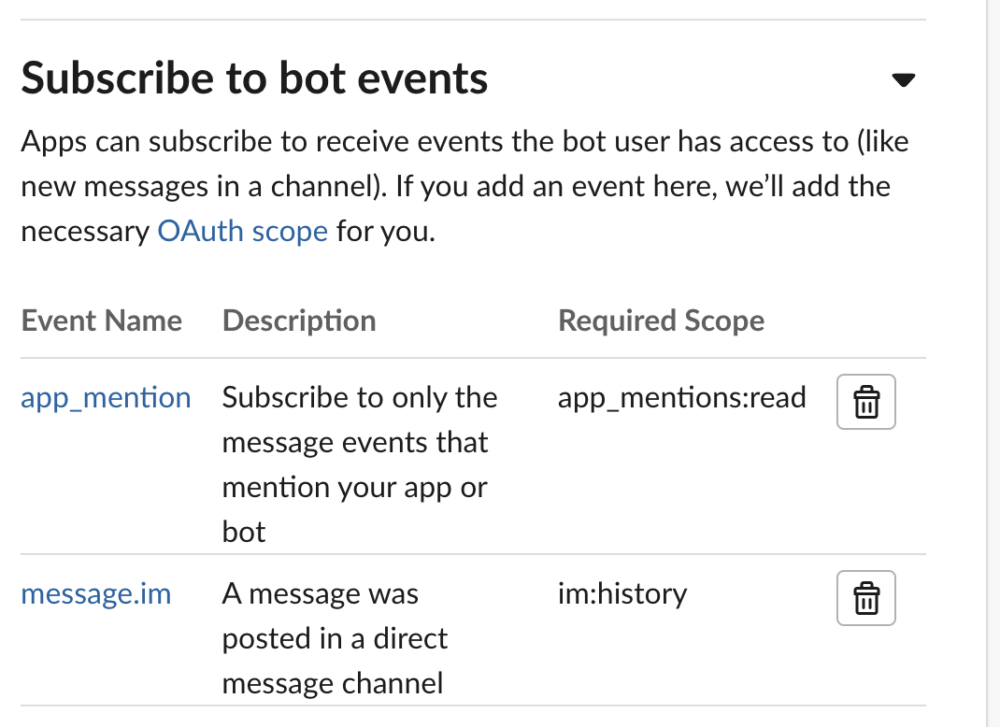
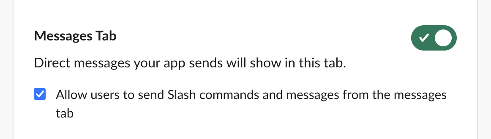
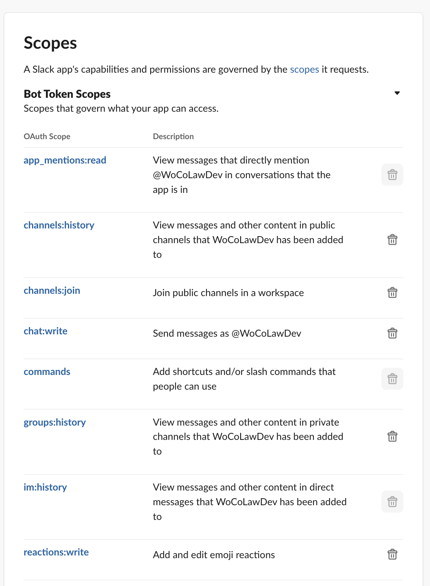

# Slack Bot Template on Google Cloud Run Functions

A template to create a simple Slack bot with Google Cloud Functions.

## Local development setup

Google Cloud Run Functions uses a simple workflow where you need the following two files:

1. `main.py`
2. `requirements.txt`

To make it even easier, use [`just`](https://github.com/casey/just):

```shell
just install
```

## Slack Bot Setup

First, you need to create a new Slack Bot in the Slack API.

1. Go to <https://api.slack.com/apps>
2. Choose "Create New App" > "From scratch"
3. Choose a name and the workspace you want to develop for

### Get credentials

For this section we recommend [direnv](https://direnv.net/docs/hook.html). If you don't want to use it, set your environment variables manually.

1. On the "Basic Information" page, copy the **signing secret** and put it into your `.envrc` file.
2. On the "OAuth & Permissions" page, copy the **bot token** and put it into your `.envrc` file.

### Set up Google Cloud

We will assume you have an existing Google Cloud environment.

In your `.envrc`, update both your project id and gcp location.

## First deployment

First, update the `justfile` so that the "name" variable reflects your Slack app name. This name will be used for your Cloud Run Function and the attached service account.

### Create a service account

We'll create a service account with limited access. This can be done with:

```shell
just create-service-account
```

### Deploy your first version

Let's deploy our first version:

```shell
just deploy
```

### Get your URL

Go to <https://console.cloud.google.com/run> and select your function. Copy the url shown at the top.

### Add your URL to Slack app

1. On the Slack API page, go to your app > "Event Subscriptions".
2. Here, plugin your URL. Slack will verify if everything works. If not, retrace your steps above.

### Subscribe to Slack events

On the "Event Subscriptions" page, choose "Add Bot User Event". These are events that we want our bot to respond to.

We choose to respond only to mentions (e.g. `@MyBot`) or direct messages to the bot.



### Enable direct messages

To make direct messages work, go to App Home and enable sending direct messages:



### Set OAuth scopes to allow your Slack app to do things

Under "Oauth & Permissions" scopes:



## Install your app to your workspace

Under "Oauth & Permissions", choose "(Re)Install to <workspace>"

## Test your app

In your Slack workspace, test your app by sending a direct message to the app or by tagging the app in a channel.
